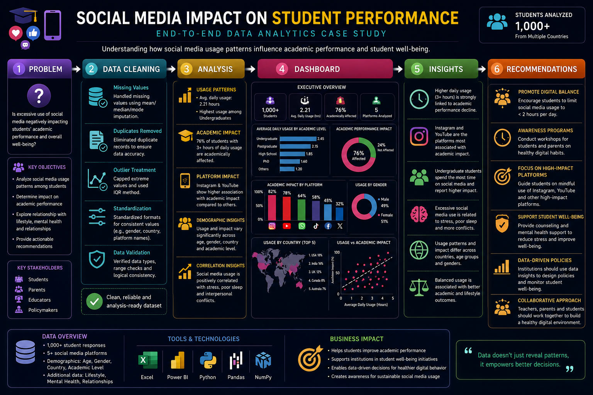
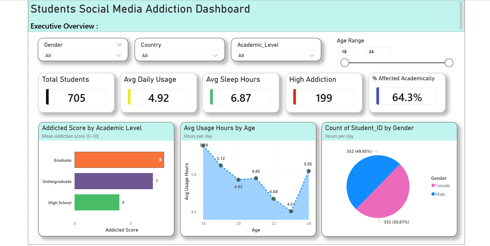
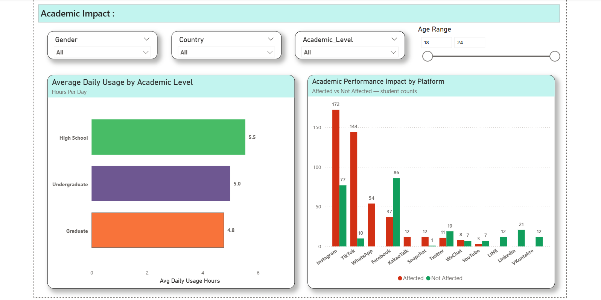
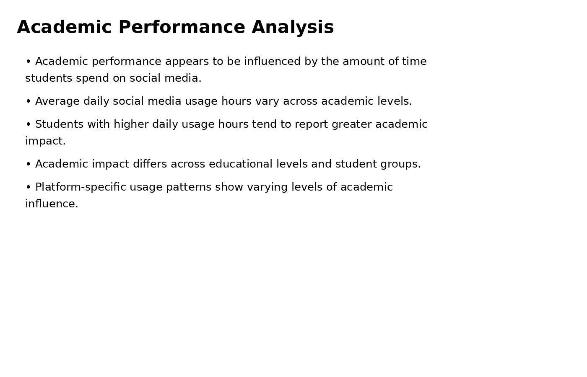
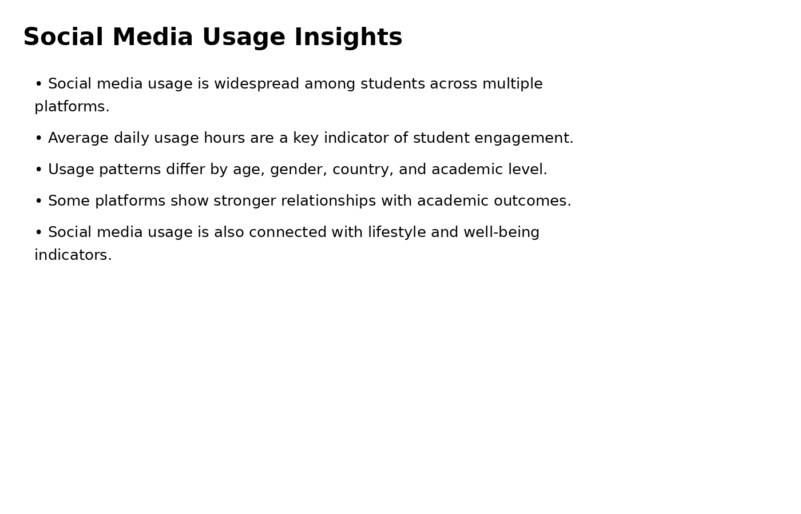

# Students Social Media Addiction & Academic Impact Dashboard

## Project Report

## Project Overview
Developed an interactive Power BI dashboard to analyze the relationship between students' social media usage and academic performance.

The dashboard provides insights into usage patterns, addiction levels, study habits, and their impact on academic outcomes.

## Objectives

* Analyze social media usage among students
* Identify addiction-related behavior patterns
* Examine the impact on academic performance
* Generate data-driven insights for educational awareness

## Dashboard Features

* Interactive KPI Cards
* Academic Performance Analysis
* Social Media Usage Trends
* Addiction Level Segmentation
* Demographic Insights
* Dynamic Filters and Slicers

### Academic Performance Analysis

### Social Media Usage Insights

## Key Findings

* Higher daily social media usage was associated with lower academic performance.
* Students with excessive screen time reported reduced study hours.
* Certain behavioral patterns indicated a higher risk of social media addiction.
* Interactive dashboards enabled detailed exploration of student engagement trends.

## Tools Used

* Power BI
* Power Query
* Data Visualization

## Key Insights

* Identified relationships between screen time and academic performance
* Highlighted high-risk student groups
* Revealed behavioral trends associated with social media addiction
* Provided actionable insights through interactive visualization

## Skills Demonstrated

Power BI | Power Query | Data Visualization | Dashboard Design | Data Analysis | Business Intelligence

